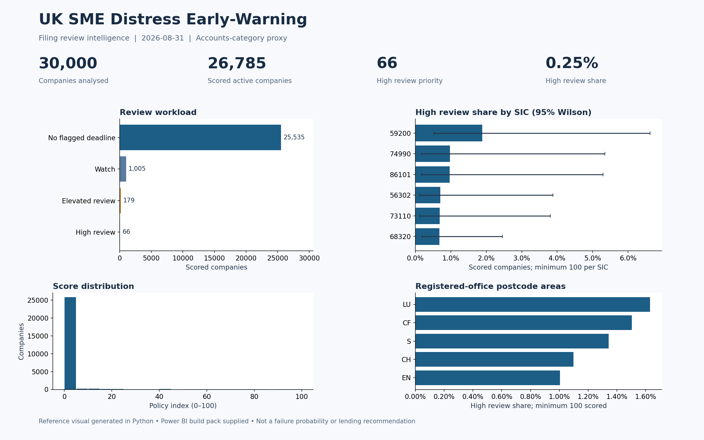
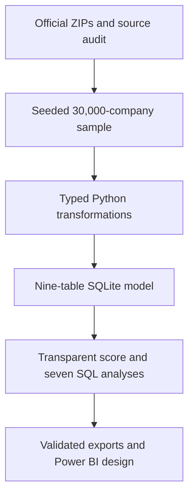

# UK SME Distress Early-Warning Platform
### Business Failure & Financial Risk Intelligence

**A reproducible registry-filing review platform for prioritising manual investigation, not a validated insolvency predictor.**

Built by **Sarthak Manjarekar** · Python · SQL / SQLite · Power BI build pack

## The question
Can public company characteristics and filing signals reveal patterns worth investigating? This release answers the filing priority question using a transparent index; historical failure prediction remains unsupported by the acquired data.

## Evidence in 60 seconds

| Actual result | Value |
|---|---:|
| Official source rows scanned | 5,689,368 |
| Accounts-category proxy population | 1,875,337 |
| Reproducible company sample | 30,000 |
| Active companies with complete scoring inputs | 26,785 |
| High review priority | 66 (0.25% of scored companies) |
| Malformed source rows explicitly quarantined | 2 |

Snapshot reference: **2026-08-31**. Real Companies House data; no synthetic analytical results.


*Python-rendered reference visual using actual results. A native PBIX was not created; the six-page Power BI build pack is included.*

## What the analysis found

- Confirmation deadlines were overdue in **38.00%** of companies with an accounts delay, versus **3.77%** without one; cross-sectional prevalence ratio **10.08**. This is filing-behaviour association, not financial-distress prediction.
- The policy selects **66** high-review and **179** elevated-review companies. **3,215** companies are explicitly unscored.
- Leading sector/area rates have very few flagged observations and wide uncertainty. Do not interpret them as reliable UK failure-risk rankings.

[Full findings](reports/findings.md) · [Sensitivity](reports/sensitivity.csv) · [Data quality](reports/data_quality.md)

## Architecture



[ER diagram](docs/architecture.md) · [Data dictionary](database/data_dictionary.md) · [Feature definitions](docs/feature_dictionary.md)

## Method

Scan all alphabetic partitions; use deterministic bottom-k SHA256 sampling. The SME proxy uses selected accounts categories, not an official employee-based classification. Score active companies with both deadlines using capped accounts and confirmation overdue days (60/40 policy weights). Status, age, industry, geography and charges do not add unsupported risk penalties. No historical targets, train/test split, AUC or probability claims are manufactured.

SQL demonstrates CTEs, joins, conditional aggregation, date arithmetic, window means, PERCENT_RANK, ranking, LAG/LEAD and pooled cohort calculations. Analysis adds Wilson intervals, age standardisation and weight/threshold sensitivity.

## Reproduce

```bash
python3 -m venv .venv
source .venv/bin/activate
python -m pip install -r requirements-lock.txt
python -m src.pipeline all
python -m unittest discover -s tests -v
```

No API key or database server required. From the delivered real sample, use `python -m src.pipeline build`. Source URLs rotate monthly; exact source reproduction requires retained ZIPs or the delivered checksum-verified sample. [Setup, refresh and optional API instructions](docs/reproduce.md).

## Repository guide

| Directory | Contents |
|---|---|
| src/ | Ingestion, cleaning, features, scoring, SQL loading, reports |
| sql/ | Seven business-focused analytical queries |
| database/ | Enforced schema and column-level dictionary |
| tests/ | Synthetic unit fixtures plus real-build reconciliation |
| dashboard/ | Six-page Power BI specification, DAX, M, theme, wireframes |
| reports/ | Actual findings, source provenance, quality and robustness |
| docs/ | Architecture, feature definitions, reproduction, publication, portfolio text |

[Build Power BI](dashboard/build_instructions.md) · [Validation](reports/validation.json) · [CV and interview material](docs/portfolio.md)

## Limitations and next steps

Single live-register snapshot; incomplete SME coverage; no financial ratios or officer histories; registered-office areas are not operating regions. The score is an uncalibrated review policy, not a lending or investment recommendation. Code is MIT; source data has separate terms. Public Git excludes raw and company-level data.

Next: collect prospective snapshots, obtain dated API histories securely, map official administrative geography and validate time-aligned outcomes before considering predictive models. [Methodology](reports/methodology.md) · [Limitations](reports/limitations.md) · [Official sources](docs/sources.md).
