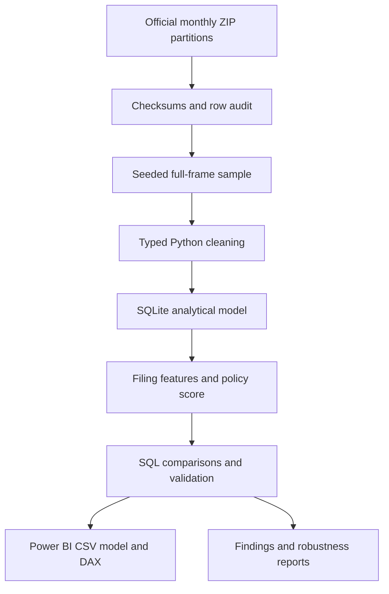
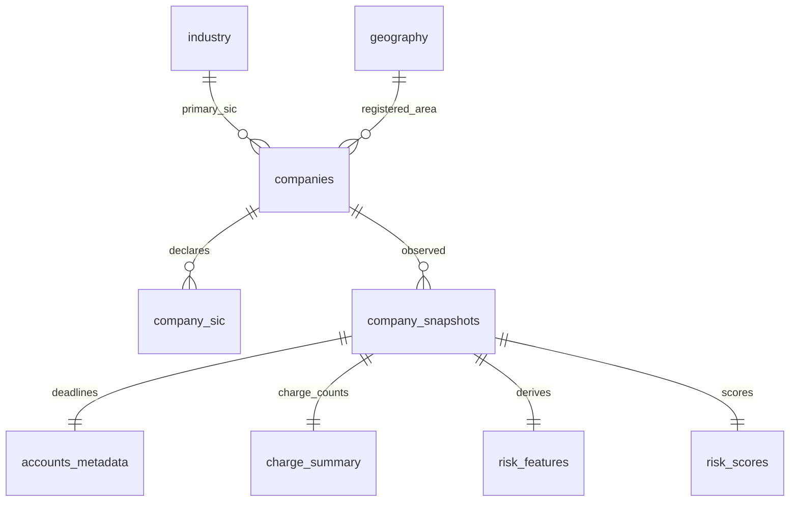

# Architecture and analytical model

SQLite is chosen for a portable embedded analytical database with enforced keys, CTEs, window functions and no server setup. Python ingestion is chunked; only a bounded candidate sample is retained. Standard-library HTTP and unittest minimise dependencies. pandas handles typed transformations; Matplotlib renders repository previews. SQL queries provide business-facing comparisons and independent arithmetic checks.

The database is rebuilt to a temporary file and atomically replaced after successful loading. The orchestrator then exports, analyses and validates. A failed run is not publication-ready. The snapshot schema could support multiple dates, but the current builder intentionally creates a single-release database; the longitudinal query returns unknown transitions, never invented history.

Status history, officers, filings and outcomes are not empty placeholder tables pretending to be populated. Optional API extraction is isolated from the validated bulk pipeline and must be integrated with point-in-time observation metadata before its features are used.
